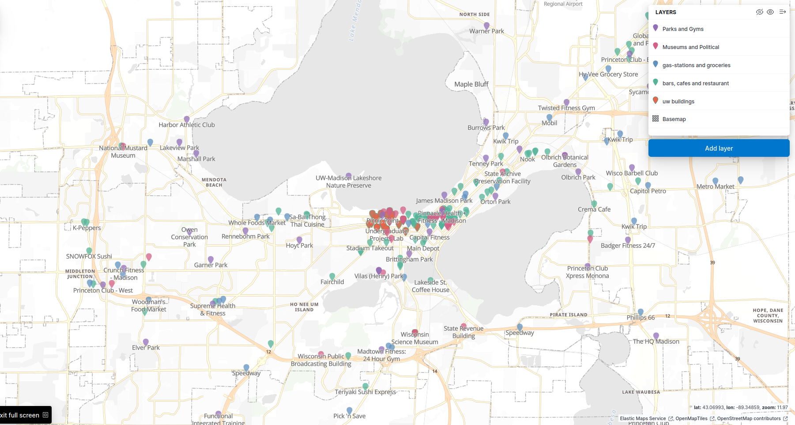
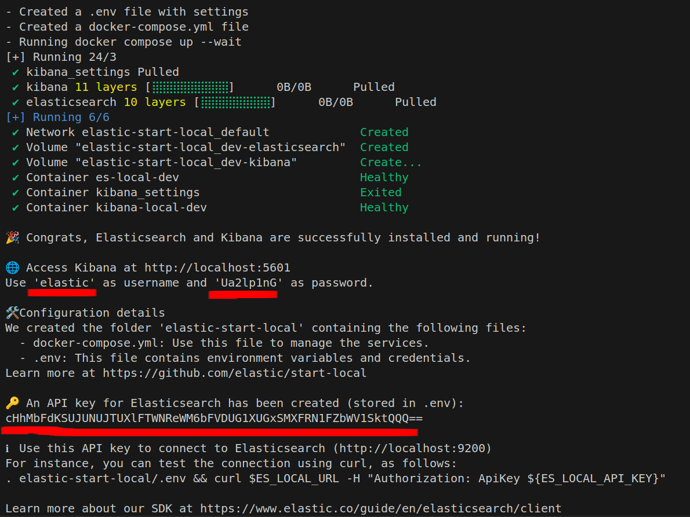
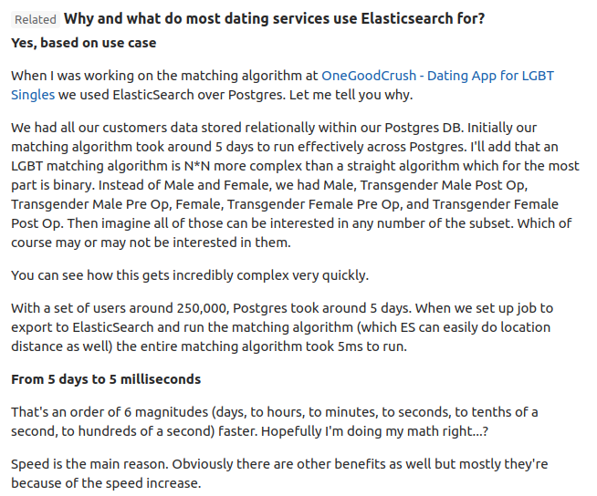

# P3 (8% of grade): Elasticsearch and Madison Interactive Kibana Map

### :outbox_tray: Github classroom link: [https://classroom.github.com/a/wC9wCjCE](https://classroom.github.com/a/wC9wCjCE)


<!-- **Github Classroom Invitation Link: [https://classroom.github.com/a/wC9wCjCE](https://classroom.github.com/a/wC9wCjCE)** -->

## Clarifications / fixes
[3/9 3:07PM] ``wget``/``unzip`` assertion no longer raised. Students may directly ``git pull`` the folder/files need for Project 3 and that should already include the ``data`` folder.
[3/10 3:54PM] Changing Q3's question to include text about loading text file data.


  
## :telescope: Overview

Learning Objectives:
* Indexing and Querying Data: Learn to index various data types and perform complex queries.
* Aggregation, Filtering and other data analysis queries: Learn to count places based on XYZ, filter them based on popularity/news mentions.
* Combining Data Sources: Integrate multiple sources of information (news, [Wikipedia](https://www.wikipedia.org/), [Google Maps](https://www.google.com/maps), [Weather.com](https://weather.com/) and custom scraping) to enrich the dataset.
* Geospatial Data Management: Understand how to handle and query GeoJSON data to represent geographic features.
* Data Visualization with Kibana: Use Kibana Maps to visualize the geospatial data dynamically and interactively.

You will be building a practical project while answering **10** cool Madison trivia questions!

--- 

## :hammer_and_wrench: Upgrade your VM to e2-medium 
- Stop and remove all running `docker` containers.
- Remove all extra/unnecessary data files. You can always redownload when you want to review those topics.
- We'll continue to have disk size as 25GB.
- Here's a helpful [tutorial](https://cloud.google.com/compute/docs/instances/changing-machine-type-of-stopped-instance) to upgrade your existing VM.
- **IMPORTANT**: It is very important that you go through this step first before you go through the installation for ElasticSearch. Otherwise, the installation might fail!

## :hammer_and_wrench: Setting up ElasticSearch using Docker

**Note** Developing in VS Code is way easier! (The extension: Remote-SSH is a life saver). Please consider switching to VS code instead of 10 floating terminals.

- In your VM, install Elastisearch and Kibana (with docker):
```bash
curl -fsSL https://elastic.co/start-local | sh
```

**This command will give you a password and an API key as shown below. Store both.**



- To restart your container, cd into `elastic-search-local`: 
```bash
docker stop es-local-dev
cd elastic-start-local
docker compose up -d
```

Sometimes you have to remove the elastic-start-local dir and start from scratch (container state becomes unhealthy when you re-start your VM sometimes)

- [Optional] Sanity check your elasticsearch connection. In your VM:
```bash
cd elastic-start-local
source .env
curl $ES_LOCAL_URL -H "Authorization: ApiKey ${ES_LOCAL_API_KEY}"
```

---


## :nut_and_bolt: Setting up `jupyter` and `python elasticsearch-client`

- Install `elasticsearch` so we can interact with elasticsearch via Python.

```bash
pip3 install elasticsearch
```

- Create a new directory (`p3`) to keep track of your p3 files and `cd` into it.
- Then, launch `jupyter` using the below command, and make note of the auto-generated URL.

```bash
jupyter notebook
```
(usually goes to port 8888)

OR if you want to specify a specific port:
```bash
jupyter notebook --port WXYZ
```

**😎 IT-Support Note:** If you see `jupyter command not found`, try this: 
```bash
export PATH=$PATH:~/.local/bin
```

- To access the `jupyter` session on your laptop, you must establish an `ssh` tunnel. Open another *local* terminal or powershell, then use either of the below commands to establish your tunnel.

```bash
ssh <USER>@IP -L localhost:8888:localhost:8888
```
or
```bash
gcloud compute ssh <VM_NAME> -- -L localhost:8888:localhost:8888
```

:point_right: Double-check that the second port matches the port in the URL.

- Now, open the jupyter URL in your browser, and create a new notebook file (File > New > Notebook). Make sure to save it as `p3.ipynb`.

---

## Good Practice: Spending time with your data first and deciding on the right tool!

Check out the JSONs, column names of csvs and skim the text data, at the very least!
This is how data in-the-wild exists. Scary right? 

Data Sources: 
* [Wikipedia API - PyPi](https://pypi.org/project/Wikipedia-API/)
* [Google Maps APIs](https://developers.google.com/maps/documentation/geocoding/overview). 
* [News API](https://newsapi.org/)

If you are curious on how data scraping works, here are some example scripts: [data_scripts](./data_scripts) 

With unstructured data processing tools like Elasticsearch you can make sense of the data better and build your downstream applications pretty quickly :)

Since Elasticsearch creates an indexable/hash-searching data-structure within, querying/searching is extremely quick. 

The unstructured-ness, speed of searching and data-scalability is where simple libraries like Pandas (assuming you come up with your own data-structure first) lose.   

Here's a real app in deployment that switched to Elasticsearch for speed (5 days to 5 ms!): 

<details>
  <summary>PostGres vs Elasticsearch: For searching</summary>
  
</details>


---  

## :floppy_disk: Writing code in `p3.ipynb`  

1. Make sure you already have the ```data``` folder in the same file hierarchy to your `p3.ipynb`.
2. **Make the connection to Elastisearch using the [python elasticsearch-client](https://www.elastic.co/guide/en/elasticsearch/client/python-api/current/index.html)** with your username (usually elastic) and password OR API key as demonstrated in the lecture. 

:warning: **Requirements (applies to all subsequent questions)**:

- Each question's resulting data dictionary must be stored into a [JSON file](https://docs.python.org/3/library/json.html) called `q<N>.json`, where `N` refers to the question number.
  - Save all the files in a directory called `answers`. Use the appropriate linux command inside your notebook to create `answers` directory. **WARNING:** **Do not** manually run this command on your VM.
  - For example, the code for storing q1's result looks like the following:

```
response = client.whatever_rest_api_call(...)
with open('answers/q1.json', 'w') as f:
    json.dump(dict(response), f, indent=4)
```

- Make sure to go back to the cell containing import statements, include `import json` (and other necessary libraries, as needed), and run that cell.

## :blue_book: Section 1: Loading Different Types of Data
> Objectives: Learn dataloading and parsing into Elastic Common Schema (ECS) using Elasticsearch bulk upload (dynamic mapping). Understand how to implement updates on existing schema on Elasticsearch. 

#### Q1: Write code that connects to the Elasticsearch client, and then retrieve detailed health information. Save the first five pairs of key-values from the resulting JSON output in ``q1.json``. [0.5 Points]
* You may use either your elastic password or API key to establish the connection.
* You can treat `ObjectApiResponse` as a Python `dict`. Any `dict` or `list` manipulations may be used to extract the first five key-value pairs. The end result must be stored in a `json` format inside `q1.json`.

#### Q2: Create an index `madmap` and bulk upload all provided JSON files except `places.json`. After the upload, retrieving the dynamic mapping configuration from Elasticsearch. Save the resulting ouptput in ``q2.json``. [0.6 Points]
* Make sure to index individual documents and not the entire `json` file.
* For example, while loading data from `halloween.json`, iterate over each `arrest` and index each document.

#### Q3 Add a new, index-able field named ``wiki`` (type: text) to the mapping from Q2. Bulk upload all the text files. Save this new dynamic mapping result in ``q3.json``. [0.6 Points]
---

## 💎 Section 2: Madison and UW-M Trivia!

**IMPORTANT NOTE:** Continue saving each question's result into ``q<N>.json`` file.

> Objectives: Implement queries in Elasticsearch

#### Q4: Find all locations that contain "University". [0.6 Points]
* Use the appropriate field for search using ``match``.
* Make sure to retrieve all matches by configuring appropriate `size`. **NOTE:** This will be a requirement for all the questions even if unspecified. Please follow this for all analysis. 

#### Q5: Find all titles of news articles that containe something similar to "Madson" (Fuzzy search). [0.6 Points]
* Results will contain duplicate articles. That is direct artifact of the dataset containing duplicate entries.
* Your response must only return `title` to make the search efficient.
* Make sure to retrieve all matches by configuring appropriate `size`.

#### Q6: Find all news articles whose `title` or `description` or `content` contains the phrase "Wisconsin Badgers". [0.6 Points]
* Use the appropriate `bool` operator along with `match_phrase`.
* Make sure to retrieve all matches by configuring appropriate `size`.

#### Q7: Find all locations that do not have "Madison" in their address. [0.6 Points]
* Use the appropriate `bool` operators. 
  * Presence of multiple types of documents within the index makes this question a complex one. You must first use the appropriate boolean operator to ensure that the search field that you are looking for exists.
* Your response must only return `name` and `formattedAddress` to make the search efficient.
* Make sure to retrieve all matches by configuring appropriate `size`.

#### Q8: What are the biggest football rivalries of Wisconsin Badgers (Boosting)? [0.6 Points]

* Using a ``simple_query_string query`` on the `wiki` field, identify and retrieve documents that reference the top football rivalries of the Wisconsin Badgers.
* Search terms:
  * Use the highest boost factor for "rivalry".
  * Use the second highest boost factor for "football"
  * Use the lowest or no boost factor for "badgers"
* Your response must only return `wiki` to make the search efficient. 

**NOTE:** You will pass the autograder if your search `_score` is higher than 6   

<details>
  <summary>
    Hint:
  </summary>
  <p>Read up on Boosting (https://weng.gitbooks.io/elasticsearch-in-action/content/chapter6_searching_with_relevancy/63boosting.html) and 'Use Cases of Boosting' (https://stackoverflow.com/a/73957996)</p>
</details>

#### Q9: Highlight rivalries. [0.6 Points]

* Use a ``match_phrase`` query and use the ``highlight`` arument to highlight the portions of the `wiki` field that mention "rivalry".
* Extract the ``highlight`` section from the top hit in the response and save the response into `q9.json`.
* Your response must only return `wiki` to make the search efficient. 

#### Q10: Write an Elasticsearch query that retrives all articles in news_madison.json where the source's "name" field exactly matches **"Nasa"**. Save the output in ``q10.json``. [0.6 points]

* Your response must return `title`, `name` of the source, and `publisedAt` to make the search efficient.

#### Q11: How many people were arrested in the State Street Halloween Party from from 2001 to 2019? Save the output in ``q11.json``. [0.6 points]

* Make sure you name your sum variable as `total_arrests_sum`.
* Your JSON file should **only contain the number** as a value with the specified key

<details>
  <summary>
    Caution!
  </summary>
  If you load your data multiple times, Elasticsearch appends the documents! You might see a higher count due to duplication.
</details>

#### Q12: What are the top 10 sources that published the most news articles?

* Make sure you name your variable as `source_count`.
* Save the output as a list in q12.json, without wrapping it in a dictionary.
* Ensure that each item in the list contains "key" (source name) and "doc_count" (number of articles).

#### Q13: How many names are listed in the location dataset?

* Make sure you name your variable as `location_name_count`.
* Your JSON file should **only contain the number** as a value with the specified key

#### Q14: How many distinct authors contributed to the news articles?

* Make sure you name your variable as `unique_authors`.
* Your JSON file should **only contain the number** as a value with the specified key

#### Q15: How many people on an average attended the State Street Halloween Party from from 2001 to 2019? 

* Make sure you name your variable as `avg_attended`.
* Your JSON file should **only contain the number** as a value with the specified key

---

## 🖌️ Section 3: Interactive Visualization: Making the 639 Madison maps application

> Objectives: Learn interactive geospatial visualization with Kibana and have fun


#### Q16: Load `places.json` into Kibana Maps [0.5 points]

* Import `places.json` into Kibana.
   - In **Import Data (Advanced)**:
     - Change the mapping for coordinates to `geo_point`.
     - Set the `name` field to `keyword`.
* Add the document to Kibana Maps in a new layer.

* Apply Filters to Categorize by `place_types`

Try adding filters to categorize places based on `place_types`. These categories go together, but you receive points regardless, as long as you load, display, and submit the PNG. Use the search bar to find the following `place_types`:  

   - `bars`, `cafes`, and `restaurants`
   - `park`, `gyms`, and `water_sports`
   - `political`, `museums`, and `tourism`
   - `gas` and `groceries`
   - `clubs`
   - `uw`

* Fit to data view → Fullscreen and take a screenshot of your screen.
* Name the file `q16.png` and add it to your repository.
  
<details>
  <summary>
    Caution!
  </summary>
  If you can't find 'water_sports', 'tourism', and 'uw' in the list, try search them instead.
</details>

#### Q17: Identify Areas in Madison with the Highest Business Density [0.5 points]

* **Apply Filters and Add a Grid Layer**
   - Filter businesses to include **all** except `uw`, `parks`, `political`, and `museums`.
   - Add a **grid layer** (Hexagonal or Square bins) to count the number of locations per area.

* Fit to data view → Fullscreen and take a screenshot of your screen.
* Name the file `q17.png` and add it to your repository.

#### Q18: Distribution of Price Levels Across Madison [0.5 points]

* **Create a Point Map and Color Code by Price Levels**
   - Filter out places with `NO_PRICE_LEVEL`.
   - Add a new layer to visualize locations.
   - Apply **custom colors** to categorize places based on **price levels**.  

* Fit to data view → Fullscreen and take a screenshot of your screen.
* Name the file `q18.png` and add it to your repository.

#### Q19: Find the Most Expensive Place in Madison [0.5 points]

* From the interactive viewer, filter for the **most expensive place** and locate the corresponding document in Kibana.
* Copy the `_source` value from Kibana.
* Save the extracted data as `q19.json`.

<details>
  <summary>Feeling lost in the interactive viewer?</summary>
  Go to **Analytics → Discover**, enter your filter query in the top bar, hover over your document(s), copy the `_source` value, and paste it into a file named `q11.json`.
</details>

#### Q20: Find the Nearest Cafe from the Computer Sciences Department [0.5 points]

* Use the **draw distance filter** tool to locate the nearest **cafe** from the Computer Sciences building.
* **Color code markers**:
   - Cafe → **Green**
   - Computer Sciences → **Red**
 
<details>
  <summary>Cannot find the Computer Science Department?</summary>
  Try searching for "Computer Sciences and Statistics"
</details>

* Take a screenshot of the filtered view and submit it as `q20.png`.


---

<details>
  <summary>Open when you are done! (Trust me it's better that way)</summary>
  
</details>

---

## :outbox_tray: Submission

- We will select your last pushed commit before the deadline as your submission.

- The structure of the required files for your submissions is as follows:
```
Project 3-<your_team_name>
|--- README.md (list names of team members at the top)
|--- autograder.py
|--- p3.ipynb
|--- data (the entire `data` folder)
|--- answers/
    ├── q1.json
    ├── q2.json
    ├── q3.json
    ├── q4.json
    ├── q5.json
    ├── q6.json
    ├── q7.json
    ├── q8.json
    ├── q9.json
    ├── q10.json
    ├── q11.json
    ├── q12.json
    ├── q13.json
    ├── q14.json
    ├── q15.json
    ├── q16.png
    ├── q17.png
    ├── q18.png
    ├── q19.json
    └── q20.png
```


## :trophy: Testing
- Run autograder by typing `pytest autograder.py` in your Project 3 directory.
