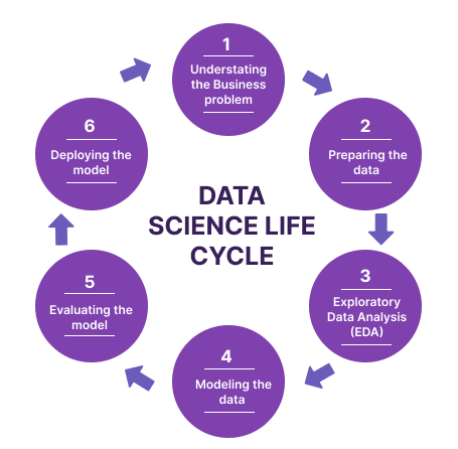

# P5 Time Series Analysis

* **Competition invite link: https://www.kaggle.com/t/9727942d265a48bdb9f5e317b065dc5d**
* **Github Classroom Invite for P5: https://classroom.github.com/a/VIgYrpSu**

---
# Clarification/Fixes

1. You can submit your plots separately if your notebook keeps dying on you.
2. You can try competing in Kaggle even if you only finish Section 2. That should be totally fine.
3. Added clarification to q5
4. Updated Submission Requirements
5. Updated the ```helper.py``` script to ensure that both the test and train datasets have consistent columns, especially for Question 7.
6. [04/22/2025 2:18 pm]: Dropping Q15 and Q16.

---

## Learning Objectives

1. Conduct comprehensive exploratory data analysis (EDA) and perform basic feature engineering.
2. Apply basic statistical models such as Exponential Moving Average (EMA) for time series analysis.
3. Understand and implement ARIMA models, including interpreting ACF and PACF plots.
4. Utilize and compare popular gradient boosting algorithms—XGBoost, LightGBM, and CatBoost—for time series forecasting using their standard implementations.
5. Experience the typical phases of a data analysis/data science project's life cycle: .
6. **[Optional]** Engage in the Kaggle competition, not just for meeting the grade component deadline but also to enjoy the challenge and strengthen your ability to navigate ongoing technological change. **Please approach the competition with integrity and do not use LLMs, to preserve the spirit of fair and independent work.**
---

## Setup

1. Create a Kaggle account *with your wisc email*, if you don't have one already. Signup here: https://www.kaggle.com/.
2. Join the Kaggle competition: [https://www.kaggle.com/t/8aca849f667809c7fb568e2845e7f44c](https://www.kaggle.com/t/9727942d265a48bdb9f5e317b065dc5d).
3. Go to the *Code* Tab and create a new notebook:


4. Download the [starter notebook](starter-s25.ipynb) provided and then import it into the notebook you just created on Kaggle.
5. Go to the ```+ Add Input``` button and add the competition data by selecting "Competition Dataset" and "Your Work":


6. Click on the ```Upload``` button and import the helper.py. Make sure to name the Dataset as ```helper```.


---
## Helper Utilities. Read the function names at least so that you are not re-writing code (refer to the helper.py)

* **make_submission**: Helps you convert your predictions to the competition submission by creating necessary files.
* **rmsle**: Implementation of the metric used to evaluate your score on the leaderboard.
* **lgbm_rmsle**: Definition that can be used to do train-val type training while printing metric scores.
* **data import**: Imports the necessary files into the notebook.
* **preprocess_holidays**: Performs some necessary cleaning on the holiday dataset.
* **preprocess_test_train**: Performs some necessary cleaning on the test and train dataset.

---

## ⚠️ Github README + `starter-s25.ipynb`

We strongly recommend reviewing each question on this github README page before you start following the directions for the corresponding question in `starter-s25.ipynb`. 

## Section 1: EDA & Feature Engineering

Concepts: Plotting, correlations, data imputation, leakage, one-hot encoding.

---

**Please perform the following preprocessing steps before you get started with answering the questions.**

- Merge the test and train dataset.
- Save this new dataframe as `merged_df`.

### Analyzing the feature: Transactions (Correlations and average trends)

**Q1. Left join `merged_df` to `transaction` and then print the *Spearman Correlation* between total sales and transactions average for a particular store on a particular date. [0.1 points]**

1. Start by performing the left join on `date` & `store_nbr`. Explore the result from this step before you proceed to the next step.
2. Group `merged_df` on `date` & `store_nbr` to compute total sales and transactions average.

**Q2. Plot an Ordinary Least Squares (OLS) trendline between transactions and sales to verify the spearman correlation value computed in Q1 using `plotly`. [0.1 points]**

⚠️ **IMPORTANT**: Make sure all plots have correct axes labeling, title, legend (depending on whether the plot requires a legend). Lack of identifying descriptions on your plot will lead to loss of points.

Save the  plot as `q2.html` using the following instructions:
- After creating your fig, use:
```
fig.write_html("/kaggle/working/plot_name.html")
```


- Go to the “Output” section on the right sidebar.
- Click the HTML file to download it.
- Create a directory called `answers` in your github repository and push the plot `html` files into the `answers` directory.

**Q3. Plot these **line** charts in the notebook using `plotly`: [0.3 points]**

1. Transactions vs Date (all stores color coded in the same plot) - this line plot is meant to be challenging to read!
2. Average monthly transactions
3. Average Transactions on the days of the week

Save the plots as `q3a.html`, `q3b.html`, and `q3c.html` respectively following the same instructions as for Q2. Make sure to push your plot `html` files to the `answers` directory.

**Requirements:**

1. X-axis should only display years (2013, 2014, 2015, 2016 and 2017) for plot A. Month for plot B and days of the week for plot C.
2. A, B and C are all single plots.

---

### Analyzing the feature: Oil (Data Imputation, Correlation can be deceptive)

**Q4. Use pandas' in-build (linear) interpolation to impute the missing oil values then plot (using `plotly`) an overlay of the imputed feature over the original. [0.1 points]**

**Requirements**:
- Make sure to use appropriate colors to your line plots so that the imputation vs the original feature is clearly visible.
- We recommend you to not use markers in your plot - that would make the lines more readable.
- This would be an example plot where legend would be required.

* Learn to use [NumPy's where](https://numpy.org/doc/stable/reference/generated/numpy.where.html) and [Pandas' interpolate](https://pandas.pydata.org/docs/reference/api/pandas.Series.interpolate.html).

**Q5. Again, left join the interpolated oil values on the dataframe from Q1 and report the spearman correlation between `oil and sales` and `oil and transactions`. [0.1 points]**

- Use the hints from Q1
- Look at the resulting dataframe after the step 1. You're trying to get total sales and average transactions!

**Q6. Report the top-3 highest negative correlations between `oil and sales of a particular product family`. Now think about whether oil should be discarded as a feature. [0.1 points]**

* Always think intuitively as well: Oil should affect an oil-dependent country! The problem statement/dataset description also said that.
* Maybe not all products are affected by oil change. People still need to eat. So bread might not be affected so much!
* If correlation values don't align with your intuition or facts, maybe you're hypothesis or dataset view is wrong?

**Q7. Implement the One hot encode function for categorical columns (including `object` type). [0.1 points]** 

### Section 2: Statistical Models

**Recommendation:** Even though the assignment does not ask for plots. Visualizing the prediction helps build intuition.

**Q8. Make a submission using an Exponential Moving Average (EMA) model for each of the product families per store.**

* ```each of the product families per store``` means you will have to train 1782 models (should take ~7 mins to fit on CPU).
* Use the `make_submission` function to generate a csv file named as ```EMA_results.csv```.

Unlike Simple Moving Average and Cumulative Moving Average (concepts you should also be familiar with), Exponential Moving Average gives more weight to the recent observations and as a result of which, it can be a better model or better capture the movement of the trend (and is also faster).
(EMA's reaction is directly proportional to the jumps in data unlike other MA methods)

**Q9. What are PACF and ACF? Analyze the time series by plotting the ACF and PACF with lag 20 for total sales value per day.**

* Briefly describe the what the plots indicate and talk about the stationary nature of the data

**Q10. Perform the ADF test on the difference series for a valid ARIMA model. Then fit an ARIMA/SARIMA model with the appropriate p, d and q values. Make a submission.**

* Print the ADF statistic and corresponding p-value.
* Print the summary after fitting the model. (Should have Jarque-Bera, Ljung-Box, Heteroskedasticity, Skew and Kurtosis) $\rightarrow$ lookup what these tests mean!
* Are the MA and AR coefficients statistically signficant?
* Make predictions for next 15 days.
* Save the predictions as ```"ARIMA_results.csv"```. Do not use the make_submission function.

```
pred_df.to_csv("/kaggle/working/ARIMA_results.csv")
```

---

### FYI

Comparison Summary Table
| Model                   | Use Case                  | Advantages                                              | Limitations                                          |
|-------------------------|---------------------------|---------------------------------------------------------|------------------------------------------------------|
| **ARIMA**               | Complex time series data with autocorrelation | Handles trends, seasonality, noise                      | Requires stationary data, parameter tuning           |
| **EMA**                 | Short-term trend analysis | Easy to implement, recent data weighted more            | Limited forecasting capability, doesn't handle seasonality well |
| **Linear Regression**   | Linear relationships      | Simple, interpretable, works with multiple predictors   | Assumes linearity, limited in non-stationary series   |


---

## Section 3: Gradient Boosted Tree Methods

**NOTE 1:** Do not worry/get hung up on Q12-14 trying to find the best hyperparameters by hit and trial. Q15 will show you a method that finds (sub) optimal hyperparamters automatically.

**NOTE 2:** You should be using all features so far except `id` for the subsequent submission questions.

**Q11. Define a validation set. What will be the most appropriate time period for this validation set?**

<details>
  <summary>
    Hint:
  </summary>
  <p>
    The validation set should ideally reflect the entire distribution of sales to make robust and generalizable models. However, since the test set is also biased towards a time-period here, the validation set should represent the test set well to achieve a lower metric score. <b>This is a big reason why models from Kaggle are often over-fitted and not deployable unless the competition hosts come up with extensive testing sets and/or metrics.</b>
  </p>
</details>


**Q12. Make a submission using LightGBM.**


**Q13. Make a submission using a CatBoost model.**


**Q14. Make a submission using an XGBoost model.**


<s>**Q15. Use optuna for automatic hyperparameter optimization for your models in questions 10, 11 and 12  to achieve a lower RMSLE.**

* Recommendation: Try 10 trials for each method.

**Q16. Which out of the three Catboost vs LightGBM vs XGBoost provides the best score? Why do you think this model is more suited to this dataset/problem?**</s>

#### [OPTIONAL] Does competition get the blood flowing for ya? 🤠 Then climb the ranks! Potential to earn extra credit*

*To earn *extra credit 💰*, achieve a *top-3 position* on the leaderboard. If your total score points is closer to a better letter grade, we'll use this ranking to boost the letter grade.

<details>
  <summary>
    Hint 1:
  </summary>
  <p> Having a solid/robust/represenatative of the underlying (true) distribution cross-validation set will help you more than you can imagine. Advice applicable till the end of times. </p>
</details>

<details>
  <summary>
    Hint 2:
  </summary>
  <p>Most Kaggle competitions are won by using an <b>ensemble</b> of methods. Try different variations! </p>
</details>

<details>
  <summary>
    Hint 3:
  </summary>
  <p>N-BEATS is a great deep learning based method. Try it out!</p>
</details>

---

## :outbox_tray: Submission

Download your final Kaggle notebook and upload it on your github repo for p5.

- We will select your last pushed commit before the deadline as your submission.
- The structure of the required files for your submissions is as follows:
```
Project 5-<your_team_name>
|--- README.md (list names of team members at the top)
|--- p5.ipynb
|--- answers/
    ├── q2.html
    ├── q3a.html
    ├── q3b.html
    ├── q3c.html
    ├── EMA_results.csv
    ├── ARIMA_results.csv
```

**NOTE: For this assignment, the TAs will grade manually. There is NO autograder.**

---

## Think Data Science is dying?

### Hear it from a Kaggle Grand Master himself on the state of current research for AI with data science:


